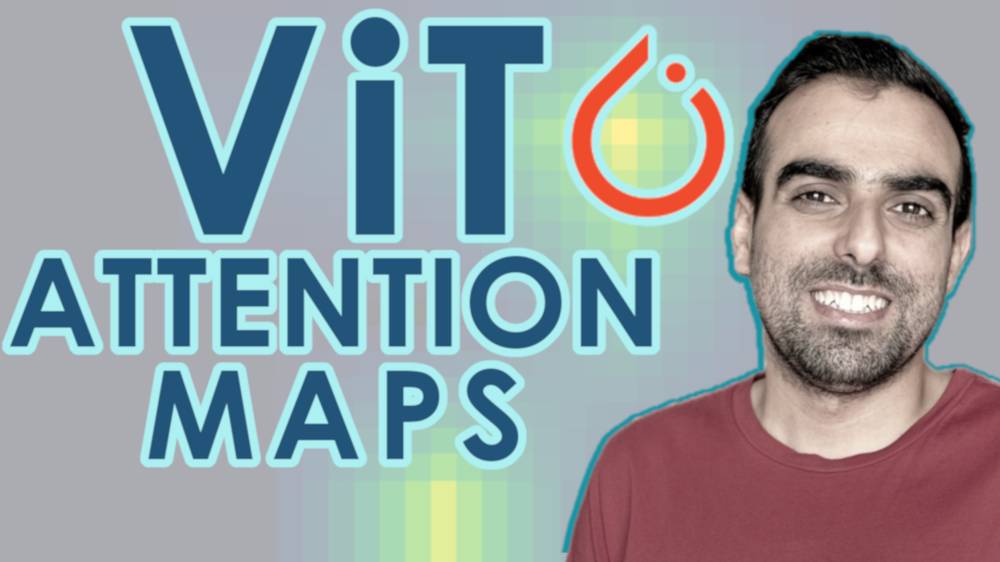
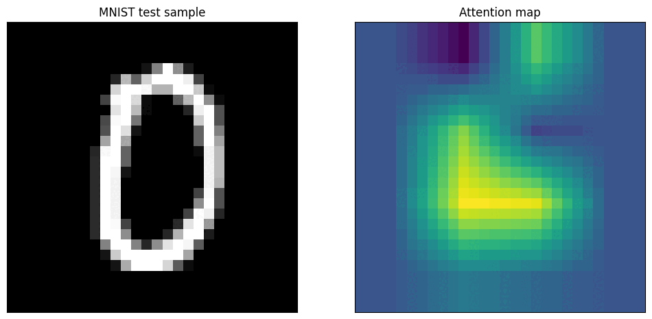
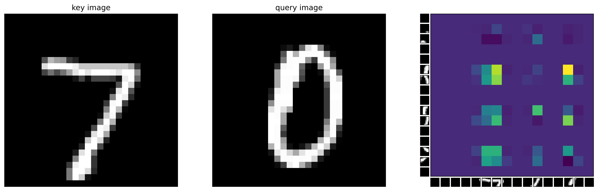

# Check out my ([YouTube Video](https://youtu.be/y1ZmMcMYjkY?feature=shared)) on ViT in JAX
[](https://youtu.be/LDwA31hARrA)

# VisionTransformer (ViT) Attention Maps using MNIST

## Code walkthrough ([YouTube Video](https://youtu.be/y1ZmMcMYjkY?feature=shared))
[](https://youtu.be/y1ZmMcMYjkY?feature=shared)


## An attention map for a test image ([code](https://github.com/mashaan14/VisionTransformer-MNIST/blob/main/VisionTransformer_MNIST.ipynb))

<p align="center">
  
</p>


## An attention map for query and key images ([code](https://github.com/mashaan14/VisionTransformer-MNIST/blob/main/VisionTransformer_MNIST_query_key.ipynb))

<p align="center">
  
</p>

## References
```bibtex
@misc{dosovitskiy2021image,
  title         = {An Image is Worth 16x16 Words: Transformers for Image Recognition at Scale},
  author        = {Alexey Dosovitskiy and Lucas Beyer and Alexander Kolesnikov and Dirk Weissenborn and Xiaohua Zhai and Thomas Unterthiner and Mostafa Dehghani and Matthias Minderer and Georg Heigold and Sylvain Gelly and Jakob Uszkoreit and Neil Houlsby},
  year          ={2021},
  eprint        = {2010.11929},
  archivePrefix = {arXiv},
  primaryClass  = {cs.CV}
}
```
